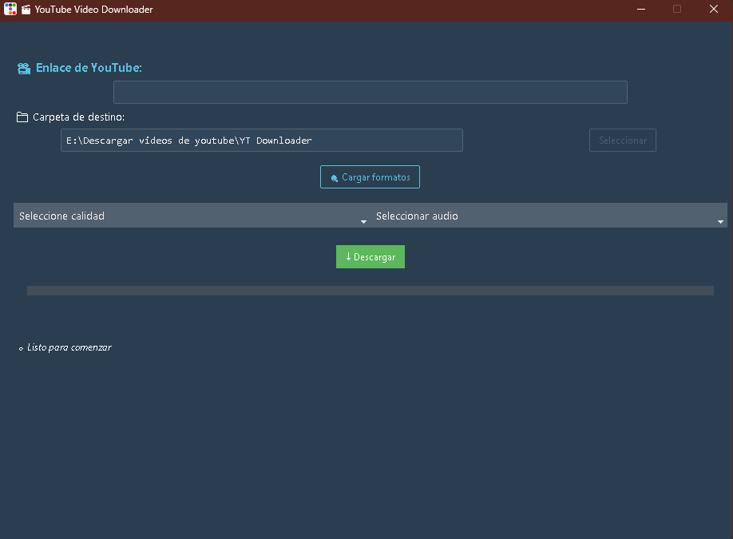

# 🎬 YouTube Downloader GUI


Aplicación de escritorio en Python con interfaz moderna para descargar videos de YouTube en diferentes calidades. Ideal para uso personal y educativo, como guardar tus propios videos o contenidos accesibles públicamente.

---

## 🚀 Características

- Selección de calidad de video y pista de audio
- Muestra la miniatura y el título del video
- Descarga video y audio combinados en formato MP4
- Detección automática de enlaces válidos desde el portapapeles
- Barra de progreso y mensajes de estado interactivos
- Interfaz ttkbootstrap

---

## 🖼️ Captura de pantalla



---

## ⚙️ Requisitos

- Python 3.11.0
- pip 22.3
- yt-dlp instalado y accesible desde el sistema (PATH)

### Dependencias Python

Instalalas ejecutando:

```bash
pip install -r requirements.txt
```

O manualmente:

```bash
pip install ttkbootstrap pillow pyperclip
```

---

## ▶️ Uso

1. Ejecutá el archivo principal:

   ```bash
   python youtube_downloader_gui.py
   ```

2. Copiá un enlace de YouTube. Si es válido, la app lo detectará automáticamente.
3. Seleccioná una carpeta de salida.
4. Elegí la calidad de video y pista de audio.
5. Hacé clic en “Descargar”.

El archivo se guardará como MP4 en la carpeta seleccionada.

---

## 🛡️ Aviso Legal

Este software fue creado con fines educativos y personales.

No fomenta ni aprueba la descarga de contenido protegido por derechos de autor.  
Úsalo únicamente para:

- Descargar tus propios videos
- Videos de dominio público o con licencia abierta
- Clases, charlas o cursos a los que tenés acceso legítimo

El autor no se hace responsable por el uso indebido de esta herramienta.

---

## 📄 Licencia

Este proyecto está licenciado bajo los términos de la Licencia MIT. Consultá el archivo LICENSE para más información.
